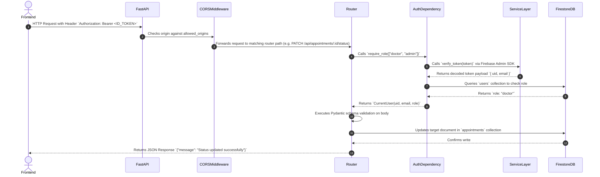
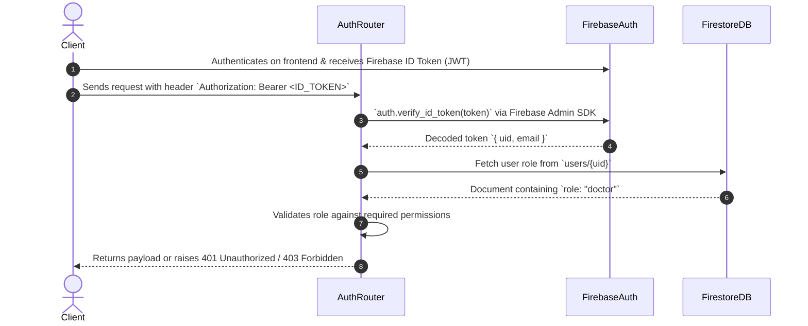
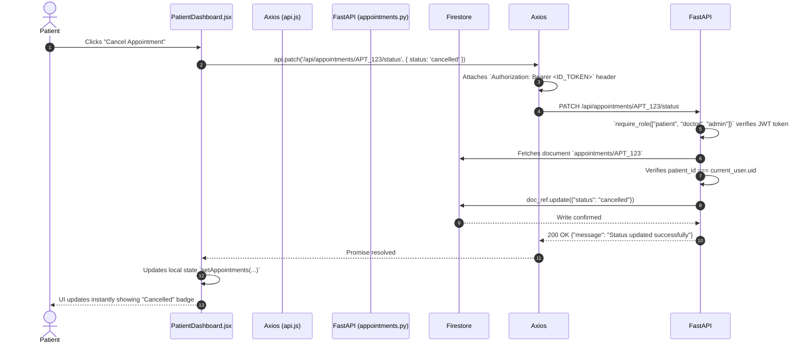

# BACKEND_ARCHITECTURE.md

# 1. Backend Overview

The **HEALTHBIRCH** backend is a high-performance Python FastAPI service providing RESTful web APIs, Firebase Admin SDK authentication verification, Firestore database interactions, and Google Gemini AI symptom triage integration.

### Core Technologies
- **Python 3.13 / FastAPI**: Modern, high-concurrency ASGI web framework with OpenAPI documentation auto-generation and Pydantic request validation schemas.
- **Firebase Admin SDK (`firebase_admin`)**: Service account authentication, custom claims verification, and direct document operations in Google Cloud Firestore.
- **Google Generative AI (`google-generativeai` / `gemini-1.5-flash`)**: Clinical AI symptom triage engine producing structured JSON assessments (severity, reasoning, specialty recommendations).
- **Pydantic (v2)**: Strict data parsing and validation models ensuring incoming request payloads match strict field contracts.
- **Uvicorn**: Lightning-fast ASGI web server implementation.

---

# 2. Backend Folder Structure

```
backend/
 ├── main.py                     # FastAPI app entry point, CORS middleware, router registration
 ├── requirements.txt            # Python dependencies (fastapi, uvicorn, firebase-admin, google-generativeai, etc.)
 ├── runtime.txt                 # Target deployment environment (python-3.13)
 ├── serviceAccountKey.json      # Private Firebase Admin credentials (gitignored for security)
 ├── models/
 │    └── schemas.py             # Pydantic schemas (UserCreate, DoctorCreate, AppointmentCreate, ProfileUpdate, etc.)
 ├── services/
 │    ├── firebase_service.py    # Firebase Admin SDK setup, token verification, Firestore DB instance
 │    └── gemini_service.py      # Google Gemini API client, system prompt construction, triage JSON parsing
 └── routers/
      ├── auth.py                # Auth dependencies: get_current_user, require_role(["patient", "doctor", "admin"])
      ├── auth_routes.py         # Registration endpoint POST /api/auth/register/doctor (admin protected)
      ├── admin.py               # Admin endpoints: doctor identity verification, CRUD, system stats
      ├── doctors.py             # Doctor directory, detail views, availability, reviews, profile update
      ├── appointments.py        # Appointment booking, list query scoping, status/severity updates
      ├── chat.py                # AI symptom triage chat endpoint with patient Firestore context injection
      ├── onboarding.py          # Conversational onboarding AI flow for extracting medical history
      └── users.py               # User profile endpoints (GET/PUT /api/users/profile)
```

---

# 3. Complete Backend Request Flow



---

# 4. Database Architecture (Firestore Schemas)

HEALTHBIRCH utilizes Google Cloud Firestore as a NoSQL document-oriented database.

### Collection: `users`
Stores user identity records for Patients, Doctors, and Admins.

- **Document ID**: Firebase Auth `uid`.
- **Fields**:
  - `name` (*string*): User full display name.
  - `email` (*string*): User primary email.
  - `role` (*string*): `'patient'` | `'doctor'` | `'admin'`.
  - `phone` (*string*, optional): Contact phone number.
  - `city`, `state`, `country` (*string*): Location parameters.
  - `createdAt` (*timestamp*): Server timestamp.
  - **Patient-Specific Fields**:
    - `healthProfile` (*map*):
      - `age`, `gender`, `height`, `weight`, `bloodType` (*string*)
      - `medications`, `conditions`, `allergies`, `diet`, `exercise` (*string*)
  - **Doctor-Specific Fields**:
    - `specialization` (*string*): Medical specialty (e.g., Cardiology, General Practice).
    - `clinic_name`, `clinic_address` (*string*): Physical practice location.
    - `experience` (*string*): Years of experience.
    - `availableDays` (*list of strings*): e.g., `["Monday", "Wednesday", "Friday"]`.
    - `availableSlots` (*list of strings*): e.g., `["09:00 AM", "10:30 AM", "02:00 PM"]`.
    - `status` (*string*): `'pending'` | `'approved'` | `'suspended'`.
    - `rating` (*number*): Average rating out of 5.
    - `reviews_count` (*number*): Total count of reviews.

### Collection: `appointments`
Stores booking records between patients and doctors.

- **Document ID**: Auto-generated string ID.
- **Fields**:
  - `patient_id` (*string*): UID of patient.
  - `patient_name` (*string*): Display name of patient.
  - `patient_email` (*string*): Contact email.
  - `doctor_id` (*string*): UID of target doctor.
  - `doctor_name` (*string*): Display name of doctor.
  - `doctor_specialization` (*string*): Specialty of doctor.
  - `date` (*string*): YYYY-MM-DD appointment date.
  - `time_slot` (*string*): Slot time e.g., `"10:30 AM"`.
  - `reason` (*string*): Reason for visit described by patient.
  - `status` (*string*): `'scheduled'` | `'in-progress'` | `'completed'` | `'cancelled'`.
  - `severity` (*string*, optional): `'Low'` | `'Moderate'` | `'Critical'` (assigned by AI or doctor).
  - `ai_summary` (*map*, optional): Preserved AI symptom analysis summary.
  - `createdAt` (*timestamp*): Creation timestamp.

### Collection: `reviews` (Sub-collection of `users/{doctorId}`)
Stores patient feedback for doctors.

- **Fields**: `patient_id`, `patient_name`, `rating` (*1-5*), `comment`, `createdAt`.

---

# 5. Authentication Backend Flow



---

# 6. API Endpoint Documentation

### Auth & User Endpoints (`routers/auth_routes.py`, `routers/users.py`)
- `POST /api/auth/register/doctor`: Admin-only endpoint to register a new doctor account (`require_role(["admin"])`).
- `GET /api/users/profile`: Retrieves current authenticated user profile & health metadata.
- `PUT /api/users/profile`: Updates patient health profile (`age`, `gender`, `height`, `weight`, `bloodType`, `city`, `medications`, `conditions`, `allergies`, `diet`, `exercise`).

### Doctor Endpoints (`routers/doctors.py`)
- `GET /api/doctors/`: Returns list of all approved doctors (`status == "approved"`).
- `GET /api/doctors/all`: Returns all doctors (including pending/suspended, required for admin view).
- `GET /api/doctors/{doctor_id}`: Returns detailed profile for specific doctor.
- `PUT /api/doctors/profile`: Doctor updates own specialization, slots, clinic address, and availability.
- `POST /api/doctors/{doctor_id}/reviews`: Patient posts a rating and comment for a doctor.

### Appointment Endpoints (`routers/appointments.py`)
- `POST /api/appointments/`: Patient creates appointment. Checks if slot is already booked for that date.
- `GET /api/appointments/patient/me`: Patient fetches their own appointments (`patient_id == current_user.uid`).
- `GET /api/appointments/doctor/me`: Doctor fetches appointments assigned to them (`doctor_id == current_user.uid`).
- `PATCH /api/appointments/{id}/status`: Doctor or patient updates appointment status (`scheduled`, `completed`, `cancelled`).
- `PATCH /api/appointments/{id}/severity`: Doctor overrides AI symptom triage severity (`Low`, `Moderate`, `Critical`).

### AI Chat & Triage Endpoints (`routers/chat.py`, `routers/onboarding.py`)
- `POST /api/chat`: Context-aware symptom triage. Reads patient's saved health profile from Firestore and injects it into Gemini prompt. Returns structured JSON with `summary`, `severity`, `recommended_specialty`, and `reasoning`.
- `POST /api/onboarding/chat`: Multi-turn conversational onboarding assistant that collects patient history and outputs extracted fields in JSON.

### Admin Endpoints (`routers/admin.py`)
- `GET /api/admin/stats`: Calculates system stats (total patients, doctors, pending verification count, appointments breakdown).
- `PATCH /api/admin/verify-doctor/{id}`: Approves (`approved`) or rejects (`suspended`) doctor account status.
- `POST /api/admin/create-doctor`: Admin creates doctor profile directly.
- `PUT /api/admin/doctors/{id}`: Admin edits doctor profile details.
- `DELETE /api/doctors/{id}`: Admin removes doctor from database.

---

# 7. Backend Business Logic & AI Guardrails

### Context-Aware Gemini AI System Prompt (`routers/chat.py`, `services/gemini_service.py`)
Before calling Gemini AI, the backend retrieves the patient's Firestore `healthProfile` (age, gender, chronic conditions, current medications, allergies) and formats it into a system background context:

```
Patient Profile:
- Age: 42 | Gender: Female
- Chronic Conditions: Asthma, Hypertension
- Current Medications: Albuterol, Lisinopril
- Allergies: Penicillin
```

### Safety & Medical Rules
- **Non-Diagnostic Constraint**: Gemini prompt explicitly mandates: *"You are an AI Symptom Triage Assistant. You do NOT provide official medical diagnoses or prescribe medications. Provide preliminary guidance only and recommend appropriate medical specialties."*
- **Emergency Escalation**: Severe red-flag symptoms (chest pain, stroke signs, extreme dyspnea) immediately force `severity: "Critical"` and instruct the patient to contact emergency services (e.g., 911 / 112).

---

# 8. Security Architecture

1. **Role-Based Access Control (RBAC)**: Enforced via FastAPI dependency injection (`require_role(["admin"])`, `require_role(["doctor"])`, `require_role(["patient"])`).
2. **UID Query Scoping**: Patient endpoints query Firestore strictly with `where("patient_id", "==", current_user.uid)` and doctor endpoints with `where("doctor_id", "==", current_user.uid)`, preventing cross-user data leakage.
3. **Secret Protection**: Firebase service key (`serviceAccountKey.json`) and API keys (`GEMINI_API_KEY`) are stored in environment variables and gitignored.
4. **Input Validation**: Pydantic schemas validate all incoming types before business logic execution, protecting against injection attacks.

---

# 9. Frontend-Backend Data Connection Example


