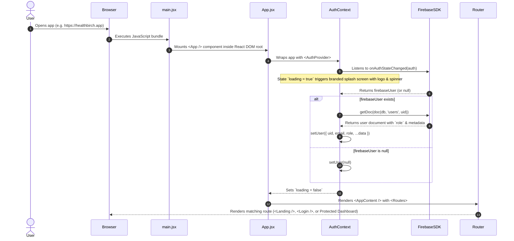
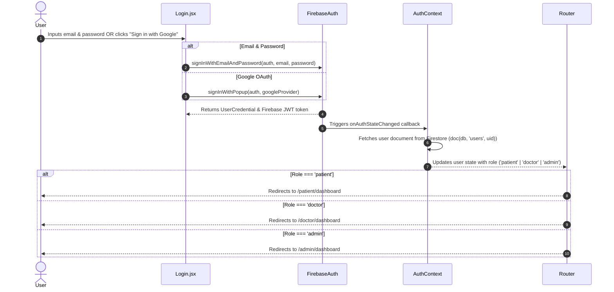

# FRONTEND_ARCHITECTURE.md

# 1. Project Overview

**HEALTHBIRCH** is an advanced AI-powered healthcare & doctor appointment booking platform. The frontend provides role-tailored web interfaces for three distinct user personas:
- **Patients**: Perform conversational AI symptom triage, discover doctors, manage personal health profiles, book appointments, rate doctors, and manage account settings.
- **Doctors**: View daily appointments, manage availability, override severity tags, review patient AI triage summaries, set profile details, and handle patient consultation workflows.
- **Administrators**: Approve/reject new doctor account registrations, verify doctor credentials/licenses, manage medical staff, view analytics, and oversee clinics across the platform.

### Main User Flows
1. **Patient Journey**: Public Landing → Register/Login → Interactive Onboarding Modal → Patient Dashboard → AI Symptom Triage Widget (Gemini API) → Doctor Search & Discovery → Slot Selection & Booking (`BookingPage`) → Manage Appointments & Write Reviews.
2. **Doctor Journey**: Admin Approval → Doctor Login → Doctor Dashboard → Overview & Schedule → Update Appointment Status (Scheduled, In-Progress, Completed, Cancelled) → Severity Override → Availability & Profile Management.
3. **Admin Journey**: Admin Login → Admin Dashboard → Overview & Analytics → Doctor Identity Verification (Approve/Reject) → Doctor Management (Create, Edit, Delete, Search) → Clinic & System Management.

### Technology Stack & Rationale
- **React (v19.2.4)**: Declarative UI rendering, fast virtual DOM diffing, and component modularity.
- **Vite (v8.0.1)**: Lightning-fast HMR (Hot Module Replacement) dev environment and optimized production bundling using Rollup.
- **React Router DOM (v7.13.2)**: Client-side single-page app (SPA) routing, route protection (`ProtectedRoute`), and dynamic route parameters.
- **Tailwind CSS (v3.4.17) + PostCSS + Autoprefixer**: Utility-first CSS engine enabling custom design tokens, glassmorphism, dynamic gradients, dark palette modes, and responsive grid/flex layouts without CSS bloat.
- **Lucide React (v1.7.0)**: Modern, lightweight icon suite providing consistent vector icons across dashboards.
- **Firebase Authentication & Firestore SDK (v12.11.0)**: Auth state persistence, JWT token generation (`getIdToken()`), and real-time Firestore database queries for user metadata.
- **Axios (v1.13.6)**: Modular HTTP client with automated Bearer token injection request interceptors and standard response error interceptors.
- **html2canvas (v1.4.1)**: Client-side DOM snapshot rendering for exporting/viewing doctor digital identity cards.

---

# 2. Frontend Folder Structure

```
frontend/
 ├── index.html                  # HTML5 SPA entry point with root mount node and font preloads
 ├── vite.config.js              # Vite configuration and React plugin setup
 ├── tailwind.config.js          # Custom brand tokens, colors, animations, font families
 ├── vercel.json                 # Single-Page Application rewrite configuration for Vercel deployment
 └── src/
      ├── App.jsx                # Root router, AuthProvider wrapper, global AI chat widget mount
      ├── main.jsx               # React DOM root render entry point
      ├── index.css              # Global Tailwind imports, custom glassmorphism & animation utility classes
      ├── assets/                # Static image assets (hero background, logo PNG, SVG icons)
      ├── components/
      │    └── shared/
      │         ├── AiChatWidget.jsx   # Global patient floating AI triage chat modal & widget
      │         ├── Navbar.jsx         # Public navigation bar with auth action triggers & mobile drawer
      │         └── ProtectedRoute.jsx # Role-based route authorization guard & redirect component
      ├── context/
      │    └── AuthContext.jsx         # React Context providing global user state & Firebase auth sync
      ├── pages/
      │    ├── Landing.jsx             # Public marketing landing page with feature cards & CTA
      │    ├── Login.jsx               # Authenticated login page (Email/Password & Google OAuth)
      │    ├── Register.jsx            # Account registration page for patients
      │    ├── PatientDashboard.jsx    # Patient hub: health profile, AI chat, appointments, reviews, settings
      │    ├── DoctorDashboard.jsx     # Doctor hub: schedule, appointment status, severity override, profile
      │    ├── AdminDashboard.jsx      # Admin hub: doctor identity approval, doctor CRUD, clinic management
      │    └── BookingPage.jsx         # Appointment slot picker, patient details form & booking submission
      └── services/
           ├── api.js                  # Axios instance with request/response interceptors
           └── firebase.js             # Firebase App, Auth, and Firestore SDK initialization
```

---

# 3. Application Startup Flow



---

# 4. Routing Architecture

### Route Map

| Path | Component | Access Level | Description |
| :--- | :--- | :--- | :--- |
| `/` | `Landing.jsx` | Public | Marketing landing page, platform overview, CTA buttons |
| `/login` | `Login.jsx` | Public | Login page for all roles (Patient, Doctor, Admin) |
| `/register` | `Register.jsx` | Public | Patient self-registration page with auto-login |
| `/patient/dashboard` | `PatientDashboard.jsx` | Protected (`patient`) | Patient control center: profile, appointments, reviews |
| `/patient/book/:id` | `BookingPage.jsx` | Protected (`patient`) | Appointment booking page for target doctor ID |
| `/patient/doctors` | `PatientDashboard.jsx` | Protected (`patient`) | Redirects to Patient Dashboard Doctor Discovery tab |
| `/doctor/dashboard` | `DoctorDashboard.jsx` | Protected (`doctor`) | Doctor schedule, appointment manager, availability |
| `/admin/dashboard` | `AdminDashboard.jsx` | Protected (`admin`) | Admin dashboard: doctor approvals, CRUD & staff list |
| `*` | `NotFound` | Public | Custom 404 page with return-to-home action |

### ProtectedRoute Guard Behavior (`src/components/shared/ProtectedRoute.jsx`)
```jsx
// Execution Flow:
1. Receives allowedRoles prop e.g., ['patient']
2. Reads { user, loading } from useAuth()
3. If loading === true -> Shows full-page loading spinner
4. If user is null -> Redirects to /login using <Navigate replace />
5. If allowedRoles is passed AND user.role is NOT in allowedRoles:
   - If user.role === 'admin' -> Redirects to /admin/dashboard
   - If user.role === 'doctor' -> Redirects to /doctor/dashboard
   - Default -> Redirects to /patient/dashboard
6. If authorized -> Renders wrapped component children
```

---

# 5. Component Architecture

### Major Component Breakdown

#### `AuthContext.jsx` (`src/context/AuthContext.jsx`)
- **Purpose**: Centralized authentication state provider. Syncs Firebase Auth session with Firestore document user profiles (`role`, `name`, `healthProfile`, etc.).
- **Props**: `children` (React nodes).
- **State**: `user` (`null` or Object), `loading` (`boolean`).
- **Used by**: Virtually all components via `useAuth()`.

#### `ProtectedRoute.jsx` (`src/components/shared/ProtectedRoute.jsx`)
- **Purpose**: Enforces access control based on user authentication status and role clearance.
- **Props**: `children` (node), `allowedRoles` (Array of strings, e.g., `['patient']`).
- **State**: None (reads from `AuthContext`).
- **Used by**: `App.jsx` router definitions.

#### `Navbar.jsx` (`src/components/shared/Navbar.jsx`)
- **Purpose**: Global responsive top navigation bar for public pages. Shows brand logo, navigation links, and dynamic Auth buttons (Sign In / Dashboard / Sign Out).
- **Props**: None.
- **State**: `mobileMenuOpen` (`boolean`), reads `user` from `useAuth()`.
- **Used by**: `App.jsx` (hidden automatically on `/patient/*`, `/doctor/*`, `/admin/*` routes).

#### `AiChatWidget.jsx` (`src/components/shared/AiChatWidget.jsx`)
- **Purpose**: Global floating AI assistant widget available to patients across all pages. Executes Gemini AI symptom triage, renders severity badges, specialty recommendations, and direct doctor booking triggers.
- **Props**: None.
- **State**: `isOpen`, `messages`, `input`, `loading`, `currentSessionId`, `triageResult`.
- **Dependencies**: `api.js` (`POST /api/chat`), `useAuth()`, `lucide-react`.
- **Used by**: `App.jsx` (rendered conditionally for patients).

#### `PatientDashboard.jsx` (`src/pages/PatientDashboard.jsx`)
- **Purpose**: Main portal for patients. Manages 5 sub-tabs: Overview, Health Profile, AI Assistant, Doctors Search, and Settings.
- **State**: Tab navigation (`activeTab`), profile form fields, health profile metadata, appointments list, doctor directory list, review modal state (`reviewModalOpen`, `reviewPayload`, `reviewStatus`), display name save status, notifications settings.
- **Data Flow**: Fetches user profile via `GET /api/users/profile`, appointments via `GET /api/appointments/patient/me`, doctor directory via `GET /api/doctors/`, updates health profile via `PUT /api/users/profile`, submits doctor review via `POST /api/doctors/:id/reviews`.

#### `DoctorDashboard.jsx` (`src/pages/DoctorDashboard.jsx`)
- **Purpose**: Main portal for doctors. Manages appointments, availability, severity tag overrides, and profile settings.
- **State**: `activeTab` ('appointments', 'schedule', 'analytics', 'settings'), `appointments`, `availability`, `selectedApt` (triage modal), `statusError` (inline notifications), `profileForm` fields.
- **Data Flow**: Fetches appointments via `GET /api/appointments/doctor/me`, updates appointment status via `PATCH /api/appointments/:id/status`, overrides severity via `PATCH /api/appointments/:id/severity`, updates profile via `PUT /api/doctors/profile`.

#### `AdminDashboard.jsx` (`src/pages/AdminDashboard.jsx`)
- **Purpose**: System administration hub. Features doctor verification queues, full staff management, analytics, doctor creation modal, and clinic list.
- **State**: `activeTab` ('overview', 'identity', 'staff', 'clinics'), `doctors`, `pendingDoctors`, `stats`, `createModalOpen`, `editModal`, `deleteConfirmId`, `deleteError`.
- **Data Flow**: Fetches doctors via `GET /api/doctors/all`, updates approval status via `PATCH /api/admin/verify-doctor/:id`, creates doctor via `POST /api/admin/create-doctor`, updates doctor via `PUT /api/admin/doctors/:id`, deletes doctor via `DELETE /api/doctors/:id`.

---

# 6. State Management

HEALTHBIRCH uses a lean, robust state management strategy avoiding heavy boilerplate libraries like Redux, combining **React Context API** for global auth and **Local Component State + Custom Hooks** for view-level data.

```
       +---------------------------------------------+
       |               AuthContext                   |
       |  - user (uid, email, role, profile data)    |
       |  - loading (boolean)                        |
       +----------------------+----------------------+
                              |
       +----------------------v----------------------+
       |           React Components / Pages          |
       |  (PatientDashboard, DoctorDashboard, etc.)  |
       |  - Local state: tabs, form inputs, modals   |
       |  - Data state: appointments, doctors list   |
       +----------------------+----------------------+
                              |
       +----------------------v----------------------+
       |                Axios API Service            |
       |  - Automatic Firebase IdToken injection     |
       |  - Direct async/await data fetching         |
       +---------------------------------------------+
```

- **Global Auth State**: Encapsulated inside `AuthContext.jsx`. Any component calls `useAuth()` to get current user role, uid, and profile status.
- **Persistence**: Firebase Auth handles session token persistence in `localStorage`/`indexedDB`. Settings toggles (e.g. `hb_emailNotif`, `hb_smsAlerts`) persist in `localStorage`.

---

# 7. Authentication Frontend Flow



---

# 8. API Communication Layer

Frontend API calls are executed through the centralized Axios client (`src/services/api.js`).

### Axios Request Interceptor
Before every outgoing HTTP request, the interceptor obtains the latest Firebase ID Token from `auth.currentUser.getIdToken()` and attaches it to the `Authorization` header:
`Authorization: Bearer <FIREBASE_ID_TOKEN>`

### Core Frontend Service Endpoints

| Function / Endpoint | HTTP Method | Target Backend Path | Description |
| :--- | :--- | :--- | :--- |
| `api.get('/api/users/profile')` | GET | `/api/users/profile` | Fetches current user profile & health metadata |
| `api.put('/api/users/profile')` | PUT | `/api/users/profile` | Updates patient health profile fields |
| `api.post('/api/chat')` | POST | `/api/chat` | Sends message to AI triage bot (returns reply + triage data) |
| `api.get('/api/doctors/')` | GET | `/api/doctors/` | Fetches list of approved active doctors |
| `api.get('/api/doctors/:id')` | GET | `/api/doctors/:id` | Fetches detailed info for doctor by ID |
| `api.post('/api/appointments/')` | POST | `/api/appointments/` | Creates a new doctor appointment |
| `api.get('/api/appointments/patient/me')` | GET | `/api/appointments/patient/me` | Fetches patient's appointment list |
| `api.get('/api/appointments/doctor/me')` | GET | `/api/appointments/doctor/me` | Fetches doctor's assigned appointments |
| `api.patch('/api/appointments/:id/status')` | PATCH | `/api/appointments/:id/status` | Updates status (scheduled, completed, cancelled) |
| `api.patch('/api/appointments/:id/severity')` | PATCH | `/api/appointments/:id/severity` | Overrides AI severity tag (doctor only) |
| `api.get('/api/admin/stats')` | GET | `/api/admin/stats` | Fetches platform analytics (admin only) |
| `api.patch('/api/admin/verify-doctor/:id')` | PATCH | `/api/admin/verify-doctor/:id` | Approves or rejects doctor credential status |

---

# 9. UI Design System

HEALTHBIRCH features a custom dark-mode aesthetic with glassmorphism effects, rich color tokens, and vibrant gradients.

### Design Tokens (`tailwind.config.js`)
- **Primary Colors**: `primary` (`#0F172A` - Slate 900), `primary-dark` (`#020617` - Slate 950), `primary-light` (`#1E293B` - Slate 800).
- **Secondary Accent**: `secondary` (`#2563EB` - Royal Blue / `#3B82F6` - Bright Blue).
- **Background**: `background` (`#0A0F1D` - Deep Cosmic Navy).
- **Text Tokens**: `textPrimary` (`#F8FAFC`), `textSecondary` (`#94A3B8`).
- **Severity Colors**:
  - `Critical`: Red (`#EF4444` / `bg-red-500/10`)
  - `Moderate`: Amber/Yellow (`#F59E0B` / `bg-amber-500/10`)
  - `Low`: Emerald/Green (`#10B981` / `bg-emerald-500/10`)

### Glassmorphism & UI Utilities (`src/index.css`)
- `.glass-panel`: `background: rgba(255, 255, 255, 0.03); backdrop-filter: blur(16px); border: 1px solid rgba(255, 255, 255, 0.08);`
- `.glass-card`: `background: rgba(15, 23, 42, 0.6); backdrop-filter: blur(12px); border: 1px solid rgba(255, 255, 255, 0.05);`

---

# 10. Complete Feature Workflows

### Workflow 1: AI Symptom Triage & Doctor Recommendation
```
User opens floating AI Chat Widget
  ↓
Types symptoms (e.g. "Severe chest pain and shortness of breath")
  ↓
AiChatWidget makes POST /api/chat call with { message, sessionId }
  ↓
Backend fetches patient Firestore health profile & injects into Gemini System Prompt
  ↓
Gemini AI processes symptoms & responds with structured triage JSON:
{ summary, severity: "Critical", recommended_specialty: "Cardiology", reasoning }
  ↓
Frontend receives response, displays chat bubble + Clinical Triage Summary Card
  ↓
If recommended_specialty is present, widget shows "Book Specialist" button
  ↓
User clicks button → Navigated to /patient/dashboard with specialty pre-filtered
```

### Workflow 2: Appointment Booking Workflow
```
Patient selects a Doctor & clicks "Book Appointment"
  ↓
Navigated to /patient/book/:id
  ↓
BookingPage loads doctor profile (availableSlots, availableDays) via GET /api/doctors/:id
  ↓
User picks Date, Available Time Slot, and types Reason for Visit
  ↓
User clicks "Confirm Booking"
  ↓
Frontend posts payload to POST /api/appointments/
  ↓
Backend validates slot availability, sets status="scheduled", saves to Firestore
  ↓
Frontend receives 200 OK → Displays success screen with appointment summary
```

---

# 11. Error Handling

- **Inline React Error Feedback**: Replaced raw browser `alert()` popups with inline state notices (`nameSaveStatus`, `cancelError`, `reviewStatus`, `statusError`, `deleteError`).
- **HTTP 401 Unauthorized**: Intercepted in `api.js` to prompt re-authentication when tokens expire.
- **Form Validation**: Clean error messaging on invalid registration/login attempts or incomplete profile submissions.
- **Loading & Empty States**: Every data grid (appointments, doctor directory, admin queue) renders branded pulse/spin loaders while fetching, and contextual empty states with actionable call-to-action buttons when empty.

---

# 12. How To Modify Frontend

### Adding a New Page
1. Create a new JSX component file in `src/pages/` (e.g., `src/pages/MedicalRecords.jsx`).
2. Open `src/App.jsx` and import the component.
3. Add a new route inside `<Routes>`:
   ```jsx
   <Route path="/patient/records" element={<ProtectedRoute allowedRoles={['patient']}><MedicalRecords /></ProtectedRoute>} />
   ```

### Adding a New Reusable Component
1. Create component file in `src/components/shared/` or sub-folder.
2. Use Tailwind utility classes and import icons from `lucide-react`.

### Connecting a New API Endpoint
1. Open `src/services/api.js` or import `api` into your component.
2. Call the endpoint using `await api.get(...)`, `api.post(...)`, etc. Token injection is automatic.
