# HEALTHBIRCH


## Engineering Handbook


> Internal technical documentation for the HEALTHBIRCH platform.
>
>
>
>This handbook serves as the primary technical reference for developers working on HEALTHBIRCH. It documents the system architecture, application structure, backend services, frontend organization, database design, AI workflows, deployment pipeline, and development conventions used throughout the project.
>
>
>
>The goal is to provide sufficient context for any developer or AI coding assistant to understand, maintain, and extend the platform without relying on undocumented implementation details.


---
# 1. Project Overview

## Purpose

HEALTHBIRCH is a full-stack AI-assisted healthcare coordination platform designed to streamline the patient journey before a medical consultation.

Instead of immediately booking an appointment, patients first interact with an AI assistant that conducts a structured symptom assessment. Using conversational inputs and the patient's existing health profile, the AI evaluates symptom severity, recommends the appropriate medical specialty, generates a clinical summary, and guides the patient toward suitable healthcare providers.

Doctors receive AI-generated consultation summaries before appointments, enabling better preparation and more informed consultations. Administrators manage practitioner accounts, platform operations, and overall system integrity through dedicated management tools.

---

## Core Objectives

- Assist patients through AI-powered symptom triage before medical consultations.
- Recommend the most appropriate medical specialist based on patient symptoms.
- Generate structured pre-consultation summaries for healthcare professionals.
- Maintain persistent health profiles to personalize future AI interactions.
- Centralize appointment booking and healthcare coordination within a unified platform.

---

## User Roles

| Role | Responsibilities |
|------|------------------|
| **Patient** | Register, complete AI onboarding, consult the AI assistant, manage personal health information, search doctors, and book appointments. |
| **Doctor** | Review appointments, access AI-generated consultation summaries, manage availability, update appointment outcomes, and maintain professional profile information. |
| **Administrator** | Create and manage doctor accounts, approve practitioners, oversee platform operations, and maintain system integrity. |

---

## High-Level Workflow

```text
Patient
   │
   ▼
Authentication
   │
   ▼
AI Health Onboarding
   │
   ▼
Health Profile Creation
   │
   ▼
AI Symptom Consultation
   │
   ▼
Severity Assessment
   │
   ▼
Specialist Recommendation
   │
   ▼
Doctor Discovery
   │
   ▼
Appointment Booking
   │
   ▼
Doctor Consultation
```

---

## Key Features

### AI Services

- Conversational health onboarding
- AI-powered symptom triage
- Context-aware clinical reasoning
- Severity assessment
- AI-generated consultation summaries
- Specialist recommendation engine

### Patient Services

- Persistent health profile
- Appointment booking
- Doctor discovery
- Consultation history
- Profile management

### Doctor Services

- Appointment management
- AI consultation summaries
- Availability management
- Patient analytics
- Profile management

### Administrative Services

- Doctor onboarding
- Practitioner approval
- Medical staff management
- Platform administration

---

## Technology Stack

<div align="center">

| Frontend | Backend | Database | Authentication | AI | Deployment |
|:--------:|:-------:|:--------:|:--------------:|:--:|:----------:|
| <br>React + Vite | <br>FastAPI | <br>Firestore | <br>Firebase Auth | Google Gemini 2.5 Flash | Vercel + Render |

</div>

---

## Engineering Highlights

- Full-stack web application
- Modular client-server architecture
- RESTful API communication
- Firebase Authentication with role-based authorization
- Cloud-native Firestore database
- AI-assisted healthcare workflows powered by Google Gemini
- Independent frontend and backend deployments
- Scalable architecture with clear separation of concerns

# 2. System Architecture

## Overview

HEALTHBIRCH follows a modular client-server architecture built around independent application layers. Each layer is responsible for a specific part of the system and communicates through well-defined REST APIs.

The frontend manages user interaction and presentation, the backend contains all business logic, Firebase provides authentication and persistent cloud storage, while Google Gemini powers the AI-driven healthcare workflows.

This separation of responsibilities keeps the application modular, scalable, secure, and easy to maintain.

---

## Architectural Principles

The architecture follows several core engineering principles:

- **Separation of Concerns** — Presentation, business logic, authentication, database operations, and AI processing are isolated into independent layers.
- **Role-Based Access Control** — Patients, doctors, and administrators access dedicated dashboards protected through Firebase Authentication and backend authorization.
- **Stateless Backend** — Every API request is authenticated independently using Firebase ID tokens without relying on server-side sessions.
- **Centralized Business Logic** — All validation, database operations, AI orchestration, and permission checks occur inside the FastAPI backend.
- **Cloud-Native Infrastructure** — Firestore provides scalable cloud storage while Vercel and Render independently host the frontend and backend.
- **Secure AI Integration** — Google Gemini is accessed exclusively through the backend, preventing API keys and prompt logic from being exposed to clients.

---

## High-Level Architecture

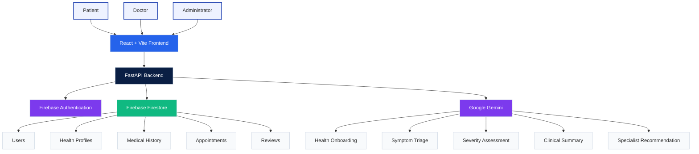

---

## System Layers

| Layer | Responsibility |
|--------|----------------|
| **Presentation Layer** | React application responsible for dashboards, routing, forms, and user interaction. |
| **API Layer** | FastAPI endpoints responsible for validation, business logic, authorization, and request handling. |
| **Authentication Layer** | Firebase Authentication verifies user identity and provides secure ID tokens. |
| **Data Layer** | Firestore stores users, health profiles, appointments, reviews, and consultation history. |
| **AI Layer** | Google Gemini performs onboarding conversations, symptom triage, severity assessment, specialist recommendation, and consultation summary generation. |
| **Deployment Layer** | Vercel hosts the frontend while Render hosts the FastAPI backend as separate services. |

---

## Request Processing Workflow

Every user interaction follows the same processing pipeline throughout the application.

```text
User Action
      │
      ▼
React Frontend
      │
      ▼
Axios API Request
      │
      ▼
FastAPI Endpoint
      │
      ▼
Authentication & Authorization
      │
      ▼
Business Logic
      │
 ┌────┴──────────────┐
 ▼                   ▼
Firestore        Google Gemini
 │                   │
 └──────┬────────────┘
        ▼
API Response
        │
        ▼
Frontend Update
```

---

## Architecture Walkthrough

### 1. Client Layer

The React frontend provides dedicated interfaces for patients, doctors, and administrators. It is responsible for rendering dashboards, handling user interactions, validating forms, and communicating with the backend through authenticated REST API requests.

### 2. Backend Layer

FastAPI serves as the central processing layer of the application. Every request passes through backend validation, authentication, authorization, business logic, database operations, and AI orchestration before a response is returned.

### 3. Authentication Layer

Firebase Authentication manages user identity. After login, the frontend sends Firebase ID tokens with every protected request. The backend verifies these tokens using the Firebase Admin SDK before allowing access to protected resources.

### 4. Data Layer

Firestore acts as the primary database, storing persistent application data including user accounts, health profiles, appointments, consultation history, and doctor reviews.

### 5. AI Layer

Google Gemini powers the intelligent healthcare workflows. It conducts conversational onboarding, evaluates patient symptoms, determines severity levels, recommends medical specialties, and generates structured consultation summaries used throughout the platform.

---

## Why This Architecture?

This architecture provides several engineering advantages:

- Independent frontend and backend deployments
- Clear separation of responsibilities
- Secure server-side handling of AI and Firebase credentials
- Stateless APIs with scalable authentication
- Centralized business logic and AI orchestration
- Easy extensibility for future dashboards, AI workflows, and backend services

# 3. Project Directory Structure

## Overview

The HEALTHBIRCH repository follows a modular full-stack architecture with a clear separation between the frontend and backend applications.

Both applications are developed and deployed independently while communicating through REST APIs. This separation improves maintainability, scalability, and allows each layer to evolve without tightly coupling implementation details.

---

## Repository Structure

```text
HEALTHBIRCH/
│
├── frontend/              # React application
├── backend/               # FastAPI application
├── README.md              # Project overview (Recruiter-facing)
├── brain.md               # Engineering handbook (Developer-facing)
├── .gitignore
└── LICENSE
```

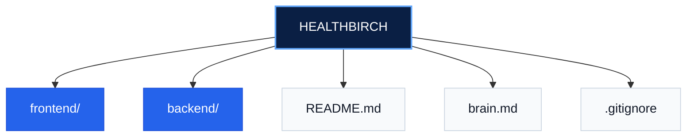

---

# Frontend

The frontend is a React + Vite application responsible for the complete user experience.

It manages routing, authentication state, dashboard rendering, AI consultation interfaces, appointment booking, and communication with the backend.

```text
frontend/
│
├── public/
├── src/
│   ├── assets/
│   ├── components/
│   ├── pages/
│   ├── services/
│   ├── App.jsx
│   └── main.jsx
│
├── package.json
├── vite.config.js
└── tailwind.config.js
```

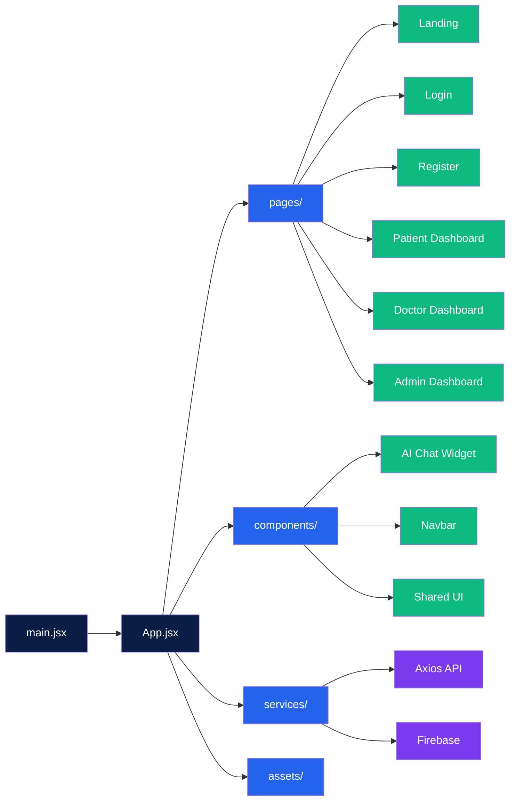

### Directory Responsibilities

| Directory | Responsibility |
|-----------|----------------|
| **pages/** | Complete application screens including Landing, Login, Patient, Doctor, and Admin dashboards. |
| **components/** | Reusable UI components shared across multiple pages. |
| **services/** | Axios API client, Firebase initialization, authentication helpers, and external service integrations. |
| **assets/** | Static assets such as images, logos, and icons. |
| **App.jsx** | Defines application routing and protected routes. |
| **main.jsx** | React application entry point. |

---

# Backend

The backend is built with FastAPI and acts as the central processing layer of the application.

It authenticates users, validates requests, executes business logic, coordinates AI interactions, communicates with Firestore, and exposes REST APIs consumed by the frontend.

```text
backend/
│
├── routers/
├── services/
├── models/
├── main.py
├── requirements.txt
└── serviceAccountKey.json
```

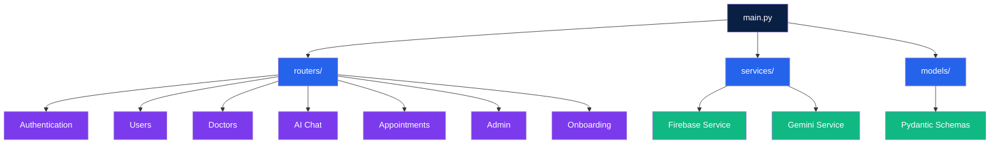

### Directory Responsibilities

| Directory | Responsibility |
|-----------|----------------|
| **routers/** | REST API endpoints grouped by feature domain. |
| **services/** | Firebase Admin SDK integration, Gemini integration, and reusable backend services. |
| **models/** | Pydantic request and response schemas used for validation. |
| **main.py** | FastAPI application entry point, middleware, router registration, and CORS configuration. |

---

## Code Organization Philosophy

The project follows a feature-oriented architecture where each module has a single, clearly defined responsibility.

- UI rendering is isolated inside the frontend.
- Business logic remains inside the backend.
- Authentication is handled by Firebase.
- AI interactions are centralized through dedicated services.
- Database operations are performed only by the backend.
- Shared functionality is extracted into reusable services and components.

This organization minimizes coupling between modules, simplifies debugging, and makes future feature development significantly easier.

# 4. AI Workflow

## Overview

The AI workflow powers the core healthcare experience within HEALTHBIRCH.

Rather than functioning as a simple chatbot, the AI operates as a structured clinical assistant that guides users through health onboarding, symptom assessment, severity evaluation, specialist recommendation, and consultation summary generation.

All AI interactions are orchestrated by the FastAPI backend, which combines patient profile information, conversation history, and system instructions before sending requests to Google Gemini.

---

## AI Responsibilities

The AI layer is responsible for the following workflows:

- Conversational health onboarding
- Patient health profile summarization
- Context-aware symptom assessment
- Pain severity evaluation
- Medical specialty recommendation
- Clinical summary generation
- Consultation history creation

---

## AI Processing Pipeline

```text
User Message
      │
      ▼
React Chat Interface
      │
      ▼
FastAPI Chat Endpoint
      │
      ▼
Load Patient Health Profile
      │
      ▼
Build System Prompt
      │
      ▼
Google Gemini
      │
      ▼
AI Response
      │
      ▼
Severity Classification
      │
      ▼
Medical History Update
      │
      ▼
Frontend Response
```

---

## AI Workflow Diagram

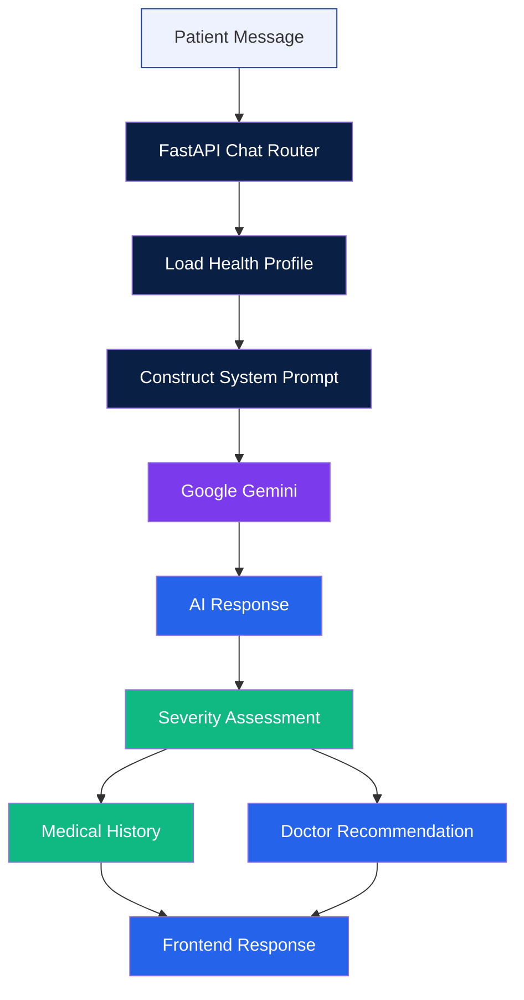

---

## AI Workflow Stages

### 1. Health Onboarding

New patients complete a conversational onboarding session where the AI collects demographic information, existing medical conditions, medications, allergies, lifestyle habits, and other relevant health information.

The collected data is stored as a structured health profile in Firestore and reused in future AI conversations.

---

### 2. Context Injection

Before every consultation, the backend retrieves the patient's health profile from Firestore.

This information is converted into a structured system prompt that provides Gemini with medical context, allowing responses to remain personalized instead of treating every conversation independently.

---

### 3. Symptom Assessment

During consultation, Gemini asks follow-up questions to better understand the patient's symptoms.

The AI gathers sufficient information before producing a recommendation instead of immediately responding to the first message.

---

### 4. Severity Evaluation

Once enough clinical information has been collected, the backend determines the consultation severity based on the AI response and predefined triage rules.

Severity determines whether the patient receives:

- Self-care guidance
- Monitoring advice
- Doctor recommendation

---

### 5. Clinical Summary Generation

After the consultation, Gemini generates a structured clinical summary describing the patient's symptoms, relevant medical history, severity assessment, and recommended next steps.

This summary is attached to appointments and presented to doctors before consultations.

---

### 6. Medical History Update

Every completed consultation is stored in the patient's medical history.

Each entry includes:

- Symptoms
- Pain rating
- Severity
- Recommended specialty
- AI recommendation
- Consultation timestamp

This allows future AI conversations to build upon previous consultations rather than starting from scratch.

---

## Design Principles

The AI workflow follows several important design principles:

- Personalized responses using persistent health profiles.
- Backend-controlled prompt construction.
- No direct frontend access to Gemini.
- Consistent structured consultation outputs.
- Server-side validation before recommendations are returned.

# 5. Authentication & Authorization

## Overview

HEALTHBIRCH uses Firebase Authentication for identity management and FastAPI for authorization.

Authentication verifies **who the user is**, while authorization determines **what the authenticated user is allowed to access** based on their assigned role.

Rather than maintaining server-side sessions, the platform uses stateless authentication through Firebase ID Tokens. Every protected API request includes a valid token, which is verified by the backend before any business logic is executed.

---

## Authentication Flow

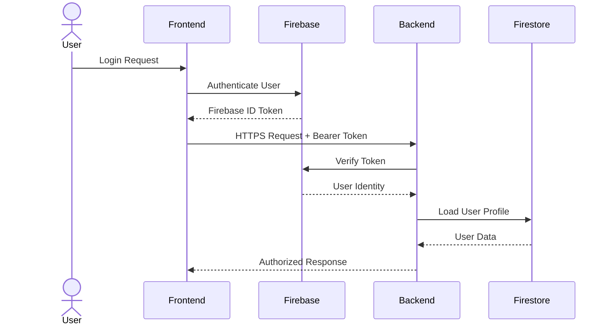

---

## Authentication Workflow

```text
User Login
      │
      ▼
Firebase Authentication
      │
      ▼
ID Token Generated
      │
      ▼
Stored by Frontend
      │
      ▼
Axios Adds Authorization Header
      │
      ▼
FastAPI Receives Request
      │
      ▼
Firebase Admin SDK Verifies Token
      │
      ▼
User Role Loaded
      │
      ▼
Protected Endpoint Executed
```

---

## Authentication Process

### Step 1 — User Login

Users authenticate using Firebase Authentication through either:

- Email & Password
- Google Sign-In (Patients)

After successful authentication, Firebase issues a secure ID Token representing the authenticated user.

---

### Step 2 — Sending Protected Requests

Every protected API request automatically includes the Firebase ID Token in the HTTP Authorization header.

```text
Authorization: Bearer <firebase_id_token>
```

The frontend handles this automatically through the centralized Axios API service.

---

### Step 3 — Backend Verification

Each protected endpoint validates the incoming token using the Firebase Admin SDK.

If the token is:

- Valid → Continue processing
- Invalid → Return Unauthorized
- Missing → Reject the request

Only verified users are allowed to access protected resources.

---

### Step 4 — Authorization

After authentication succeeds, the backend retrieves the authenticated user's role from Firestore.

Role-based authorization determines whether the user is permitted to access the requested endpoint.

Current roles include:

- Patient
- Doctor
- Administrator

Protected routes enforce these permissions before executing any business logic.

---

## Role-Based Access Control

| Role | Accessible Features |
|------|---------------------|
| Patient | Health onboarding, AI consultation, doctor discovery, appointment booking, profile management |
| Doctor | Dashboard, appointments, patient summaries, analytics, profile management |
| Administrator | Doctor management, approvals, platform administration |

---

## Protected Route Flow

```text
Incoming Request
        │
        ▼
Read Authorization Header
        │
        ▼
Verify Firebase Token
        │
        ▼
Load User
        │
        ▼
Check Required Role
        │
   ┌────┴────┐
   │         │
 Allowed   Denied
   │         │
   ▼         ▼
Execute    Return 403
Endpoint   Forbidden
```

---

## Security Principles

The authentication system follows several important security practices:

- Stateless authentication using Firebase ID Tokens.
- Backend verification for every protected request.
- Role-based authorization for sensitive endpoints.
- Firebase Admin SDK credentials remain server-side.
- Frontend never communicates directly with Firestore using administrative privileges.
- AI services are accessible only through authenticated backend endpoints.

# 4. Application Workflows

This section explains the end-to-end workflows implemented within HEALTHBIRCH.

Understanding these workflows makes it significantly easier to locate the relevant frontend pages, backend routers, Firestore collections, and AI interactions when modifying or extending the platform.

---

# Patient Journey

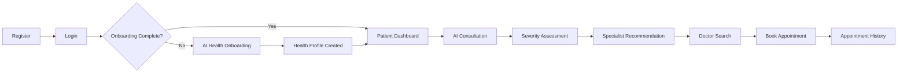

### Workflow

1. A patient creates an account using Firebase Authentication.

2. After the first successful login, the application checks whether onboarding has already been completed.

3. If onboarding is incomplete, the AI assistant conducts a guided health interview and builds the patient's health profile.

4. Once onboarding is finished, the patient gains access to the dashboard.

5. Patients can start an AI consultation by describing their symptoms in natural language.

6. The backend combines the patient's health profile with the current conversation before sending it to Google Gemini.

7. Gemini evaluates the symptoms, determines severity, recommends a medical specialty, and generates a structured consultation summary.

8. Patients can immediately search for verified doctors matching the recommended specialty and schedule an appointment.

9. Consultation history and appointments remain available from the dashboard.

---

# Doctor Workflow

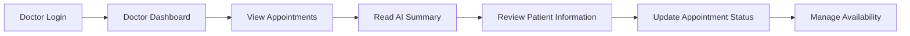

### Workflow

1. Doctors authenticate using credentials created by an administrator.

2. The dashboard displays scheduled appointments.

3. Every appointment includes an AI-generated consultation summary created during the patient's triage session.

4. Doctors review patient information before the consultation.

5. Appointment status and availability can be updated directly from the dashboard.

---

# Administrator Workflow

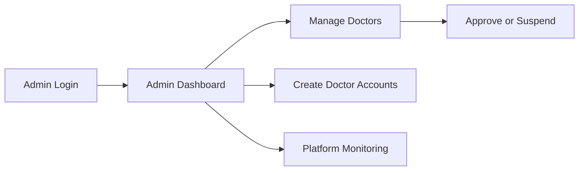

### Workflow

Administrators manage platform operations including:

- Creating doctor accounts
- Approving practitioners
- Suspending doctors
- Monitoring platform activity
- Maintaining healthcare staff records

---

# AI Consultation Workflow

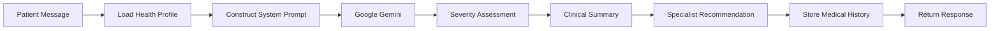

### Workflow

Every AI consultation follows the same processing pipeline:

- Patient symptoms are received by the backend.
- The patient's stored health profile is retrieved from Firestore.
- A contextual system prompt is constructed.
- Google Gemini processes the conversation.
- The AI returns severity, recommendations, and a structured consultation summary.
- Consultation results are saved to the patient's medical history.
- The frontend renders the AI response in real time.

---

## Design Principles

These workflows were designed around several engineering principles:

- Guided user journeys
- Context-aware AI interactions
- Centralized backend processing
- Persistent medical history
- Separation between presentation, business logic, and AI orchestration
- Role-specific user experiences

# 5. Database Design

## Overview

HEALTHBIRCH uses **Google Firebase Firestore** as its primary NoSQL cloud database.

Instead of traditional SQL tables, data is organized into **collections** containing **documents**. Each document stores structured information about users, appointments, reviews, and consultation history.

The backend exclusively communicates with Firestore using the Firebase Admin SDK. The frontend never accesses the database directly, ensuring all validation, authorization, and business logic remain centralized within the FastAPI backend.

---

## Database Architecture

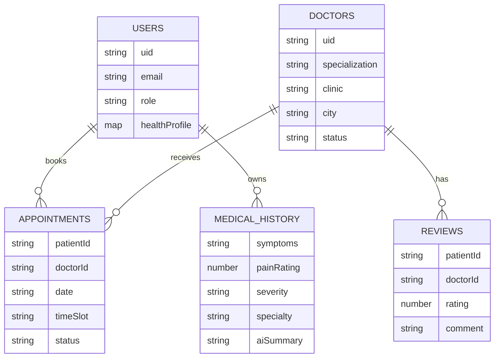

---

# Firestore Collections

The application currently uses the following primary collections.

| Collection | Purpose |
|------------|---------|
| `users` | Stores authentication details, health profiles, and doctor information |
| `appointments` | Stores appointment bookings and consultation details |
| `reviews` | Stores doctor reviews submitted by patients |

---

# users Collection

The `users` collection stores all authenticated users regardless of role.

Depending on the user's role (`patient`, `doctor`, or `admin`), different fields become available.

### Common Fields

| Field | Type | Description |
|------|------|-------------|
| uid | String | Firebase User ID |
| email | String | User email |
| role | String | patient / doctor / admin |
| name | String | Display name |

---

### Patient Fields

| Field | Type |
|------|------|
| onboardingComplete | Boolean |
| healthProfile | Map |
| medicalHistory | Array |

The patient's health profile contains information collected during AI onboarding, including:

- Age
- Gender
- Height
- Weight
- Blood Type
- Medical Conditions
- Allergies
- Medications
- Diet
- Exercise
- City
- AI-generated health summary

---

### Doctor Fields

| Field | Type |
|------|------|
| specialization | String |
| clinic_name | String |
| clinic_address | String |
| phone | String |
| city | String |
| country | String |
| experience | String |
| availableDays | Array |
| availableSlots | Array |
| rating | Number |
| reviews_count | Number |
| status | String |

---

# appointments Collection

Each document represents a single appointment between a patient and a doctor.

| Field | Description |
|--------|-------------|
| patientId | Patient document ID |
| doctorId | Doctor document ID |
| symptoms | Symptoms entered by patient |
| aiSummary | AI-generated consultation summary |
| aiSeverity | AI severity assessment |
| specialization | Recommended specialty |
| status | Pending / Confirmed / Cancelled / Rejected |
| appointmentDate | Selected date |
| appointmentTime | Selected time slot |

---

# reviews Collection

Stores patient feedback after completed consultations.

| Field | Description |
|--------|-------------|
| doctorId | Doctor being reviewed |
| patientId | Reviewer |
| rating | Rating value |
| comment | Written review |
| timestamp | Review creation time |

---

# Data Relationships

Although Firestore is a NoSQL database, HEALTHBIRCH maintains logical relationships between collections using document identifiers.

Examples include:

- A patient document references multiple appointments through `patientId`.
- A doctor document references appointments through `doctorId`.
- Reviews are linked to doctors using `doctorId`.
- Medical history remains embedded inside the patient's document to simplify retrieval during AI consultations.

---

# Design Decisions

Several design decisions influenced the current Firestore structure:

- Health profiles are embedded within the user document to minimize database reads.
- Medical history is stored alongside the patient profile to provide immediate AI context.
- Appointment documents duplicate selected patient and doctor information to simplify dashboard rendering.
- Firestore's flexible schema allows additional medical fields to be introduced without requiring database migrations.

# 6. Backend API Design

## Overview

The HEALTHBIRCH backend is built using **FastAPI** and follows a modular router-based architecture.

Instead of placing every endpoint inside a single application file, APIs are grouped according to their domain (authentication, users, appointments, doctors, AI chat, onboarding, and administration). Each router is responsible for a single feature area, making the backend easier to maintain and extend.

Every protected request follows the same processing pipeline:

1. Receive HTTP request.
2. Verify Firebase Authentication token.
3. Validate request using Pydantic models.
4. Execute business logic.
5. Interact with Firestore and/or Google Gemini.
6. Return a standardized JSON response.

---

## Backend Architecture

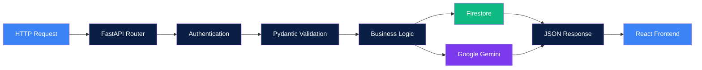

---

# Router Organization

The backend is divided into independent routers based on business functionality.

| Router | Responsibility |
|---------|----------------|
| `auth.py` | Authentication helpers and role verification |
| `auth_routes.py` | Doctor registration APIs |
| `users.py` | Patient profile management |
| `chat.py` | AI consultation endpoints |
| `onboarding.py` | AI onboarding conversation |
| `appointments.py` | Appointment management |
| `doctors.py` | Doctor profile and reviews |
| `admin.py` | Administrative operations |

Each router exposes only the endpoints related to its responsibility, reducing coupling between features.

---

# Service Layer

The backend uses a service layer to isolate external integrations from business logic.

| Service | Responsibility |
|----------|----------------|
| `firebase_service.py` | Initializes Firebase Admin SDK, verifies ID tokens, and provides Firestore access |
| `gemini_service.py` | Sends prompts to Google Gemini and processes AI responses |

Keeping these integrations inside dedicated services prevents code duplication across routers and simplifies future changes.

---

# Request Validation

Every incoming request is validated using **Pydantic** models before reaching the business logic.

Validation ensures:

- Required fields are present
- Correct data types are used
- Invalid requests are rejected early
- API contracts remain consistent

This reduces runtime errors and keeps endpoint implementations clean.

---

# Authentication & Authorization

HEALTHBIRCH uses **Firebase Authentication** for identity management.

For protected endpoints:

1. The frontend sends the Firebase ID token in the Authorization header.
2. The backend verifies the token using Firebase Admin SDK.
3. User information is extracted from the verified token.
4. Role-based authorization determines whether the requested resource can be accessed.

This approach keeps the backend stateless while ensuring every request is securely authenticated.

---

# API Categories

The backend APIs are organized into the following functional groups.

| Category | Purpose |
|----------|---------|
| Authentication | User identity and doctor registration |
| Users | Patient profile management |
| AI Consultation | Symptom triage and conversational AI |
| Onboarding | Health profile creation |
| Doctors | Doctor profiles, schedules, and reviews |
| Appointments | Booking and appointment lifecycle |
| Administration | Platform management and doctor approval |

---

# Error Handling

The backend follows consistent error-handling practices.

Examples include:

- Invalid authentication tokens
- Missing resources
- Validation failures
- Unauthorized access
- Appointment conflicts
- AI service failures

All errors return structured JSON responses so the frontend can display meaningful feedback to users.

---

# Design Decisions

The backend architecture follows several engineering principles:

- Modular router-based organization
- Stateless authentication
- Clear separation between routers and services
- Centralized validation using Pydantic
- Server-side AI orchestration
- Independent frontend and backend deployment
- RESTful API design


# 7. AI Pipeline & Prompt Architecture

## Overview

Artificial Intelligence is the core component of HEALTHBIRCH. Rather than functioning as a generic chatbot, the AI acts as a context-aware healthcare assistant capable of conducting structured onboarding interviews, symptom triage, severity assessment, specialist recommendation, and clinical summary generation.

All AI interactions are orchestrated by the FastAPI backend. The frontend never communicates directly with Google Gemini.

---

## AI Responsibilities

The AI system performs four primary tasks throughout the application.

| AI Capability | Purpose |
|--------------|---------|
| Health Onboarding | Builds a persistent patient health profile through a conversational interview. |
| Symptom Triage | Collects symptoms and asks relevant follow-up questions. |
| Clinical Reasoning | Evaluates symptom severity and recommends an appropriate medical specialty. |
| Consultation Summary | Generates a structured summary that doctors receive before appointments. |

---

## AI Architecture

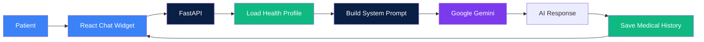

---

# AI Processing Pipeline

Every AI consultation follows the same backend workflow.

```text
Patient Message
        │
        ▼
Receive API Request
        │
        ▼
Verify User Authentication
        │
        ▼
Load Health Profile
        │
        ▼
Construct System Prompt
        │
        ▼
Send Prompt to Gemini
        │
        ▼
Receive AI Response
        │
        ▼
Save Consultation History
        │
        ▼
Return Response to Frontend
```

---

# Health Profile Injection

Before sending any prompt to Google Gemini, the backend retrieves the patient's stored health profile from Firestore.

The following information may be included in the system prompt:

- Age
- Gender
- Height
- Weight
- Blood Type
- Existing Medical Conditions
- Allergies
- Current Medications
- Diet
- Exercise Habits
- City
- AI-generated Health Summary

Providing this context allows the AI to generate personalized responses instead of treating every consultation as a new conversation.

---

# Symptom Triage

During a consultation, the AI conducts a structured conversation to understand the patient's condition.

Typical objectives include:

- Collect symptoms
- Ask relevant follow-up questions
- Estimate symptom severity
- Identify possible medical specialty
- Recommend appropriate next steps

The AI is designed to gather sufficient context before providing recommendations rather than responding immediately after the first message.

---

# Severity Assessment

After analyzing the patient's responses, the AI assigns a severity level.

| Severity | Description |
|----------|-------------|
| Mild | Self-care guidance may be sufficient. |
| Concerning | A medical consultation is recommended. |
| Severe | Immediate medical attention should be considered. |

The severity assessment is used throughout the application to guide appointment recommendations and consultation summaries.

---

# Consultation Summary Generation

Once the triage conversation is complete, Google Gemini generates a structured consultation summary.

The summary typically includes:

- Reported symptoms
- Relevant medical context
- Overall clinical observations
- Recommended specialty
- Severity assessment
- Suggested next steps

This summary is stored with the appointment and presented to doctors before the consultation begins.

---

# Medical History Persistence

Every completed AI consultation is stored inside the patient's medical history.

Stored information includes:

- Symptoms
- Pain rating
- Severity
- Recommended specialty
- AI consultation summary
- Consultation timestamp

Persisting this information enables future consultations to build upon previous interactions and provides doctors with additional historical context.

---

# AI Design Principles

The AI workflow was designed around several engineering principles:

- Context-aware conversations using persistent health profiles.
- Backend-controlled prompt construction.
- Server-side protection of API credentials.
- Consistent AI behavior across all consultations.
- Human-in-the-loop healthcare, where AI supports—but does not replace—medical professionals.


# 8. Deployment Architecture

## Overview

HEALTHBIRCH is deployed as a cloud-native full-stack application with the frontend and backend hosted independently.

This separation allows each service to be deployed, updated, and scaled without affecting the other while maintaining communication through REST APIs.

---

## Deployment Stack

| Component | Platform |
|----------|----------|
| Source Control | GitHub |
| Frontend | Vercel |
| Backend | Render |
| Database | Firebase Firestore |
| Authentication | Firebase Authentication |
| AI Provider | Google Gemini |

---

## Deployment Architecture

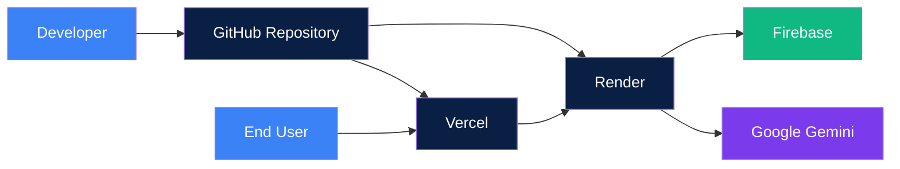

---

## Deployment Workflow

Every production deployment follows the same workflow.

```text
Developer
      │
      ▼
Git Commit
      │
      ▼
Push to GitHub
      │
      ├──────────────┐
      ▼              ▼
Vercel         Render
      │              │
Deploy Frontend   Deploy Backend
      │              │
      └──────┬───────┘
             ▼
      Production Environment
```

---

## Frontend Deployment

The React application is deployed using **Vercel**.

Whenever changes are pushed to the production branch, Vercel automatically:

- Pulls the latest source code
- Installs project dependencies
- Builds the React application
- Deploys the latest production version
- Serves the application through the production URL

---

## Backend Deployment

The FastAPI backend is deployed using **Render**.

Each deployment automatically:

- Pulls the latest backend source
- Installs Python dependencies
- Starts the FastAPI application
- Exposes the REST API through the production endpoint

---

## Environment Variables

Sensitive credentials are never committed to the repository.

Production secrets are stored using platform environment variables, including:

- Firebase Configuration
- Firebase Admin Credentials
- Google Gemini API Key
- Backend API URLs
- Frontend Configuration

This approach prevents secrets from being exposed in source control.

---

## Continuous Deployment

HEALTHBIRCH follows a Git-based deployment workflow.

Every push to the production branch automatically triggers new deployments on both Vercel and Render.

No manual deployment steps are required after pushing code to GitHub.

---

## Deployment Benefits

The deployment architecture provides several advantages:

- Independent frontend and backend deployments
- Automatic production deployments
- Secure environment variable management
- Cloud-hosted scalable infrastructure
- Simplified maintenance and release process

# 9. Development Guide

## Overview

This section provides the information required to set up a local development environment, understand the project's development workflow, and follow the engineering conventions used throughout HEALTHBIRCH.

Following these guidelines helps maintain consistency across the codebase and reduces integration issues when introducing new features.

---

# Local Development Setup

## Prerequisites

Before running the project locally, ensure the following software is installed.

| Software | Recommended Version |
|-----------|---------------------|
| Node.js | 20+ |
| Python | 3.10+ |
| Git | Latest |
| npm | Latest |

---

## Clone Repository

```bash
git clone https://github.com/shakshijha06/healthbirch.git

cd healthbirch
```

---

## Frontend Setup

```bash
cd frontend

npm install

npm run dev
```

The frontend will start on:

```
http://localhost:5173
```

---

## Backend Setup

Create and activate a virtual environment.

```bash
cd backend

python -m venv venv
```

Windows

```bash
venv\Scripts\activate
```

Install dependencies.

```bash
pip install -r requirements.txt
```

Start the FastAPI server.

```bash
uvicorn main:app --reload
```

The backend will start on:

```
http://localhost:8000
```

---

# Environment Variables

Before running the project, configure the required environment variables.

Examples include:

- Firebase Client Configuration
- Firebase Admin Credentials
- Google Gemini API Key
- Backend Base URL

Sensitive credentials should never be committed to the repository.

---

# Development Workflow

The recommended development workflow is shown below.

```text
Create Feature Branch
        │
        ▼
Implement Feature
        │
        ▼
Test Changes
        │
        ▼
Build Frontend
        │
        ▼
Commit Changes
        │
        ▼
Push to GitHub
        │
        ▼
Open Pull Request
        │
        ▼
Merge
```

---

# Coding Conventions

The project follows several engineering conventions.

## Frontend

- Build reusable components whenever possible.
- Keep pages focused on UI composition.
- Store API logic inside the services layer.
- Avoid duplicated component logic.
- Use descriptive component names.

---

## Backend

- Keep routers focused on a single domain.
- Move reusable logic into services.
- Validate every request using Pydantic.
- Keep endpoints stateless.
- Avoid embedding business logic inside route handlers whenever possible.

---

# Adding New Features

## Adding a New Page

1. Create a page inside `frontend/src/pages`.
2. Register the route inside `App.jsx`.
3. Add navigation if required.
4. Connect the page to backend APIs through the service layer.

---

## Adding a New API

1. Create or update the appropriate router.
2. Define request models.
3. Implement business logic.
4. Register the router in `main.py`.
5. Test the endpoint before deployment.

---

## Adding a New Firestore Collection

1. Define the document structure.
2. Create backend CRUD operations.
3. Validate incoming data.
4. Connect the frontend through the API layer.

---

# Testing Checklist

Before pushing changes, verify the following.

- Frontend builds successfully.
- Backend starts without errors.
- Authentication works correctly.
- Firestore operations succeed.
- AI workflows behave as expected.
- No sensitive credentials have been committed.

---

# Common Pitfalls

Developers working on HEALTHBIRCH should keep the following in mind.

- Never expose Firebase Admin credentials to the frontend.
- Never call Google Gemini directly from the client.
- Keep API keys inside environment variables.
- Do not bypass backend validation.
- Preserve the separation between frontend, backend, AI services, and database operations.

---

# Future Enhancements

The current architecture is designed to support future expansion.

Potential improvements include:

- Real-time appointment notifications
- Video consultations
- Electronic medical records integration
- Multi-language AI consultations
- AI-assisted follow-up recommendations
- Advanced analytics dashboards
- Notification and reminder services

---
# 10. API Reference

## Authentication

| Method | Endpoint | Description |
|---------|----------|-------------|
| POST | /api/auth/register/doctor | Register a doctor |

---

## Users

| Method | Endpoint | Description |
|---------|----------|-------------|
| GET | /api/users/profile | Get patient profile |
| PUT | /api/users/profile | Update patient profile |

---

## Doctors

| Method | Endpoint | Description |
|---------|----------|-------------|
| GET | /api/doctors | Search doctors |
| GET | /api/doctors/me | Current doctor profile |
| PUT | /api/doctors/me | Update doctor profile |
| POST | /api/doctors/{id}/reviews | Submit review |
| GET | /api/doctors/{id}/reviews | Fetch reviews |

---

## Appointments

| Method | Endpoint | Description |
|---------|----------|-------------|
| POST | /api/appointments | Book appointment |
| GET | /api/appointments/patient | Patient appointments |
| GET | /api/appointments/doctor | Doctor appointments |
| PATCH | /api/appointments/{id}/status | Update appointment status |

---

## AI

| Method | Endpoint | Description |
|---------|----------|-------------|
| POST | /api/chat | AI Consultation |
| POST | /api/chat/onboarding | AI Health Onboarding |
| GET | /api/chat/opening-message | Personalized greeting |

---

## Admin

| Method | Endpoint | Description |
|---------|----------|-------------|
| GET | /api/admin/doctors | All doctors |
| POST | /api/admin/create-doctor | Create doctor |
| PATCH | /api/admin/{id}/status | Approve/Suspend doctor |
| DELETE | /api/admin/delete-doctor/{id} | Delete doctor |
# Closing Notes

HEALTHBIRCH was designed with a modular architecture that separates presentation, business logic, artificial intelligence, and persistent data storage into independent layers.

This engineering handbook serves as the primary technical reference for understanding the application's architecture, workflows, and development practices. Contributors are encouraged to follow the documented structure and conventions to ensure the platform remains maintainable, scalable, and consistent as new features are introduced.

# 11. Future Roadmap

Potential future enhancements include:

- Video consultation support
- AI follow-up reminders
- Prescription management
- Electronic Health Record integration
- OCR medical report uploads
- Multi-language consultations
- Notification system
- Analytics dashboard
- Mobile application
- Hospital integration APIs


